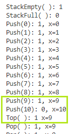
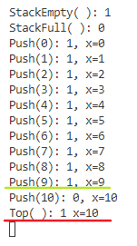
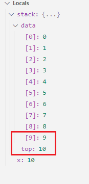
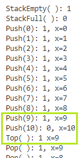

# 栈（Stack）

## 顺序栈

### top初始值的影响

需要注意一下top初始值-1和0的区别

1. top初始值为-1

   栈顶指针即栈顶元素在数组中的下标,初始化为-1

   入栈：`S.data[++S.top] = x;`

   出栈：`x = S.data[S.top--];`

   栈空：`S.top == -1`

   栈满：`S.top == MaxSize-1`

2. top初始值为0

   栈顶指针为栈中元素个数,初始化为0

   入栈：`S.data[S.top++] = x;`

   出栈：`x = S.data[--S.top];`

   栈空：`S.top == 0`

   栈满：`S.top == MaxSize`

### 由于初始值不同引发的 bug 解决

#### 背景描述

`SqStack(Top Start From Zero).cpp` 为 `SqStack.cpp` 的copy

修改了[## top初始值的影响](# top初始值的影响) 中指出的几个需要修改的地方，测试出现异常

#### 问题描述

1. `SqStack.cpp` 正常执行结果

   

   `10` 入栈失败，栈顶元素应为 `9` ，输出正常

2. `SqStack(Top Start From Zero).cpp` 异常执行结果

   

   `10` 入栈失败，栈顶元素应为 `9`，输出异常，显示栈顶为 `10`

#### 分析过程

1. 设置断点debug



根据内存中的变量数值，变量无误，栈顶元素 `stack[9]` 确实是 `9`

2. 看一下Top函数

```c++
// 获取栈顶元素
bool Top(SqStack S, int &x)
{
    if (StackEmpty(S)) // 栈空，没得元素出栈
        return false;
    x = S.data[S.top]; // 通过x传回栈顶元素
    return true;
}
```

line 6 `x = S.data[S.top];` 可知，问题出在取值使用了 `top`，由于 top∈[0,MaxSize]，此处应改为 `x = S.data[S.top-1];`

#### 问题解决

修改后再运行，问题解决



## 链式栈

基于链表实现，由于操作都在头指针，实现难度不大，带不带头结点都不需要对特定情况（摘链后栈空、插入前栈空）做特殊判断，操作通用

# 队列（Queue）

## 顺序队列

1. `rear` 指向队尾元素的**下一个位置**

2. `front` 指向队头元素

3. `rear`、`front` 初始化为 `0`

4. `(Q.rear+1)%MaxSize==Q.front` 队满

5. `Q.front == Q.rear` 队空

6. 入队和出队操作，都将 `front` 或 `rear` +1 再对 `MaxSize` 取余

   `Q.rear  = (Q.rear  + 1) % MaxSize;` 入队

   `Q.front = (Q.front + 1) % MaxSize;` 出队

   > 队列长度（元素个数）=(rear+MaxSize-front)%MaxSize

### 队满判断的几种方式

#### 牺牲队尾的一个存储空间（默认方案）

`(Q.rear + 1) % MaxSize == Q.front` 队尾再向后一个位置是 `front`，队满

#### 队列定义中添加一个变量 `size` 记录当前队列长度

```c++
#define MaxSize 10
typedef struct
{
    int data[MaxSize];
    int front, rear;
    int size; // 当前队列长度
} SqQueue;
```

通过 `size==MaxSize` 判断是否队满

同样，可以通过 `size==0` 判断是否队空

#### 队列定义中添加一个标记变量 `tag` 记录最近一次**变更**操作

```c++
#define MaxSize 10
typedef struct
{
    int data[MaxSize];
    int front, rear;
    int tag; // 最近一次操作是删除/插入
} SqQueue;
```

变更操作，即入队和出队

在出队操作成功时，将 `tag` 设为 `0`

在入队操作成功时，将 `tag` 设为 `1`

`Q.front == Q.rear && tag == 0` 队空（`tag` 初始化为0，保证第一次入队判断为队空）

`Q.front == Q.rear && tag == 1` 队满


## 链式队列

基于链表实现，由于存在头尾两个结点，对于带头结点和不带头结点的实现，在初始化、删除最后一个结点和添加第一个结点时，需要做特殊情况区分，总体而言难度不大